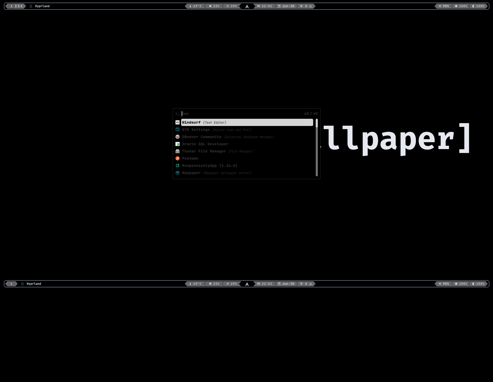
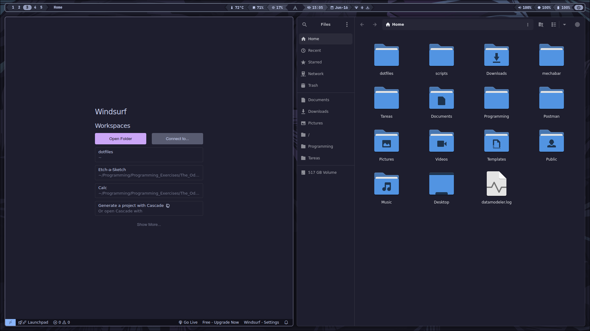
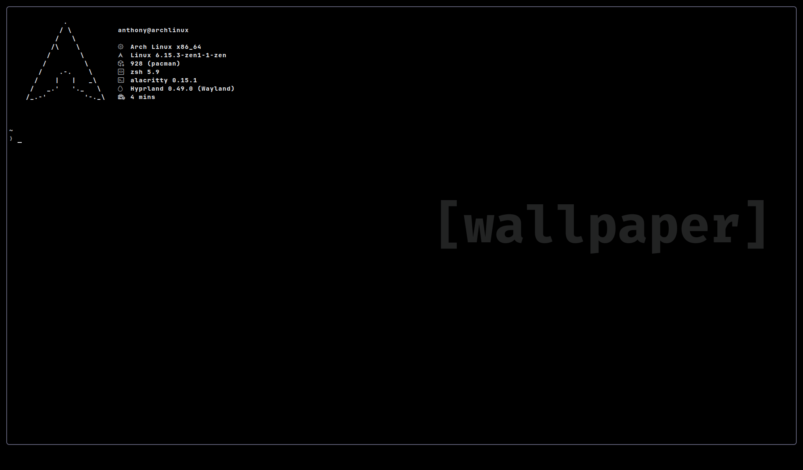

# Dotfiles System Arch/Hyprland/Wayland

This is a collection of my dotfiles, which I use to configure my system.

| Package                                           | Usage                        |
| ------------------------------------------------- | ---------------------------- |
| alacritty                                         | Terminal                     |
| rofi-lbonn-wayland-git                            | Launcher                     |
| waybar                                            | Status bar                   |
| ttf-jetbrains-mono-nerd                           | Font                         |
| ttf-font-awesome                                  | Font - Icons                 |
| hyprland                                          | Window manager               |
| swww                                              | Wallpaper                    |
| htop                                              | System monitor               |
| hyprpicker                                        | Color Picker                 |
| onlyoffice                                        | Document viewer              |
| visual-studio-code-bin                            | Code editor                  |
| windsurf                                          | IDE                          |
| pnpm                                              | Package manager              |
| npm                                               | Package manager              |
| jdk-openjdk                                       | Java                         |
| xdg-desktop-portal-wlr                            | Desktop portal(for obsidian) |
| papirus-icon-theme                                | Icons                        |
| pavucontrol                                       | Volume control               |
| networkmanager                                    | Network manager              |
| bluez bluez-utils bluez-tools                     | Bluetooth                    |
| waypaper                                          | Wallpaper                    |
| sddm                                              | Display manager              |
| qogir-cursor-theme-git                            | Cursor theme                 |
| pipewire pipewire-alsa pipewire-pulse wireplumber | Audio                        |
| brightnessctl                                     | Brightness control           |
| pulseaudio pulseaudio-alsa                        | Audio                        |
| wpctl                                             | Audio                        |
| fzf                                               | Fuzzy finder                 |
| zoxide                                            | Directory jumper             |
| zsh                                               | Shell                        |
| gtk3                                              | GTK3                         |
| gtk4                                              | GTK4                         |
| qt5ct                                             | Qt5                          |
| kvantum                                           | Qt5                          |
| catppuccin-gtk-theme-mocha                        | GTK Theme                    |

## Waybar

I use this repository for the waybar with some personal changes on scripts, modules and visibility<br>
[Waybar Mechabar](https://github.com/sejjy/mechabar)


## Installation

### Yay installation

```bash
sudo pacman -S --needed git base-devel && git clone https://aur.archlinux.org/yay-bin.git && cd yay-bin && makepkg -si

```

### Packages

```bash
yay -S alacritty rofi-lbonn-wayland-git waybar ttf-jetbrains-mono-nerd hyprland swww htop hyprpicker onlyoffice visual-studio-code-bin windsurf pnpm npm jdk-openjdk xdg-desktop-portal-wlr ttf-font-awesome papirus-icon-theme pavucontrol networkmanager bluez bluez-utils bluez-tools waypaper sddm qogir-cursor-theme-git pipewire pipewire-alsa pipewire-pulse wireplumber brightnessctl pulseaudio pulseaudio-alsa wpctl fzf zoxide zsh gtk3 gtk4 qt5ct kvantum catppuccin-gtk-theme-mocha

```

## Images




